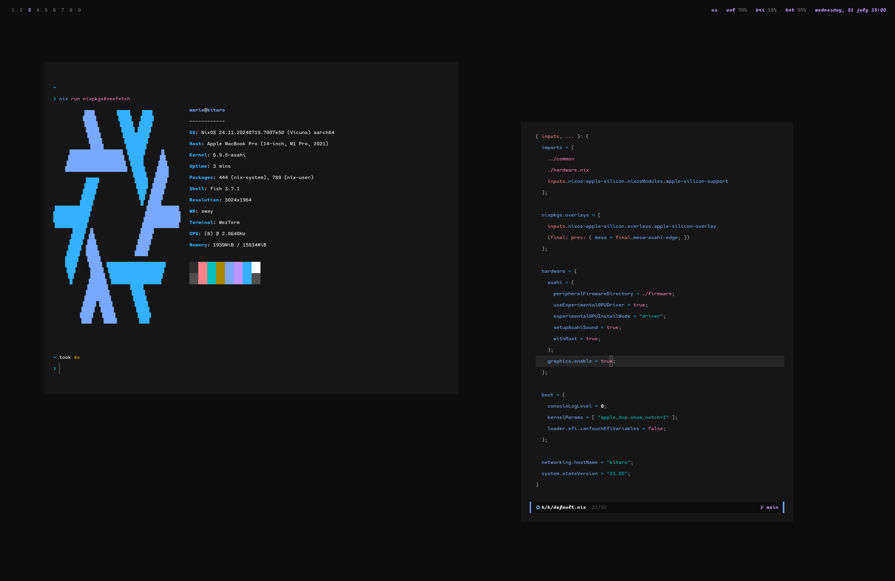

# NixOS dotfiles for Asahi Linux



## Installing NixOS

Follow [nixos-apple-silicon guide](https://github.com/tpwrules/nixos-apple-silicon/tree/main/docs/uefi-standalone.md)

```bash
sudo nixos-rebuild boot --flake .#yuki
reboot
```
